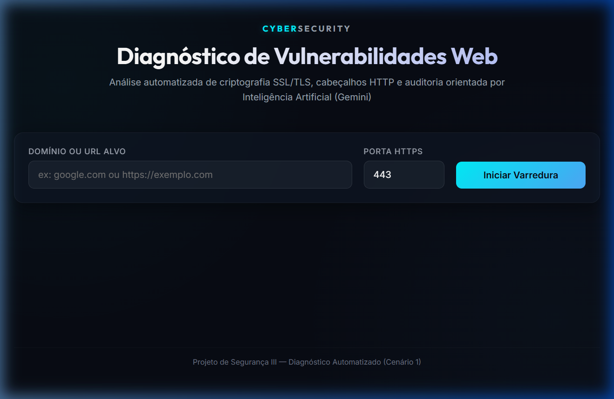
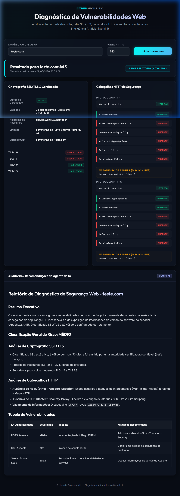
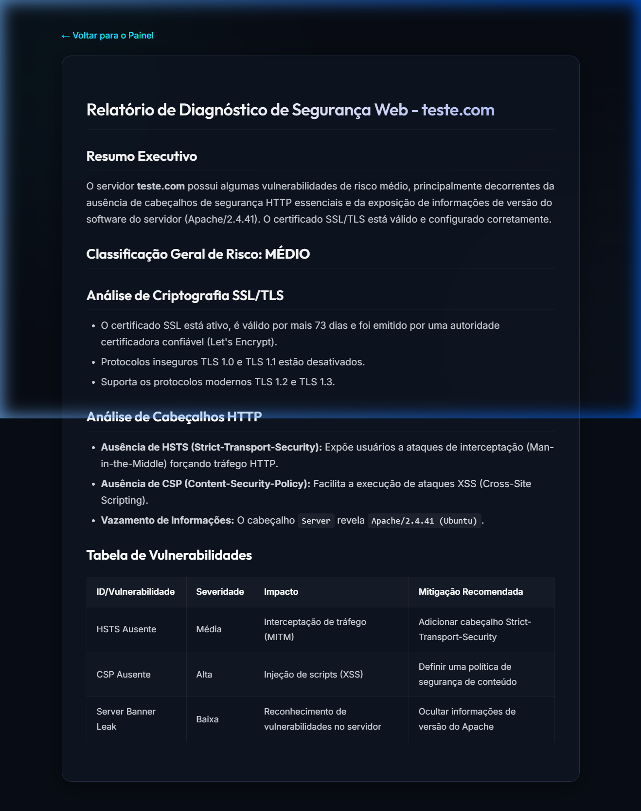

# Diagnóstico Automatizado de Vulnerabilidades Web

Uma aplicação web com UI, utiliza a API do Google Gemini para realizar varreduras de segurança em servidores web. A ferramenta analisa a criptografia SSL/TLS, a validade de certificados digitais e a presença de cabeçalhos HTTP de segurança. Os dados coletados são consolidados e enviados para o **Google Cloud Vertex AI (Gemini)** para gerar um diagnóstico de auditoria completo e recomendações de mitigação personalizadas.

---

## Demonstração Visual

### 1. Painel Inicial (Dashboard)
A tela inicial onde você define o domínio alvo e a porta para análise:


### 2. Resultados da Varredura
Painel completo exibindo as informações do certificado SSL/TLS, versões de TLS aceitas, cabeçalhos HTTP de segurança e o início do relatório gerado pelo Gemini:


### 3. Visualização do Relatório (Nova Aba)
Visualização isolada, limpa e estilizada em Markdown do relatório completo gerado pela IA ao abrir em uma nova aba:


---

## Passo a Passo para Configuração e Execução

Siga as etapas abaixo para configurar o ambiente e executar a interface web no seu sistema.

### Passo 1: Instalar Dependências do Sistema
Certifique-se de ter o Python 3.10 ou superior instalado no seu sistema. Em seguida, instale as dependências de rede e do servidor Flask listadas no `requirements.txt`:

```bash
pip install -r requirements.txt
```

### Passo 2: Configurar o Google Cloud SDK (GCP)
A ferramenta utiliza a API do Vertex AI. É necessário ter uma conta no Google Cloud Platform, um projeto ativo com a API Vertex AI habilitada e as credenciais configuradas na sua máquina.

1. **Instale o Google Cloud SDK** no seu sistema.
2. **Autentique-se** no terminal utilizando o comando:
   ```bash
   gcloud auth application-default login
   ```
3. Garanta que o projeto e região configurados estejam alinhados com suas permissões de uso do Vertex AI.

### Passo 3: Configurar Variáveis de Ambiente (`.env`)
Crie ou configure o arquivo `.env` na raiz do projeto contendo as definições necessárias para autenticação e operação da IA:

```env
GCP_PROJECT=seu-projeto-gcp
GCP_LOCATION=us-central1
GEMINI_MODEL=gemini-2.5-flash
```

*Nota: O modelo padrão utilizado é o `gemini-2.5-flash`.*

### Passo 4: Iniciar o Servidor e Executar a Varredura

1. **Inicie o servidor local Flask:**
   ```bash
   python app.py
   ```
2. **Acesse no navegador:**
   Abra o endereço [http://127.0.0.1:5000](http://127.0.0.1:5000) no seu navegador.
3. **Execute o Scan:**
   Insira o domínio ou URL alvo (ex: `google.com` ou `https://exemplo.com`), defina a porta HTTPS (padrão: `443`) e clique em **Iniciar Varredura**.

### Passo 5: Analisar Resultados e Relatórios
1. **Dados na Tela**: O painel exibirá o resumo das informações do certificado SSL, a compatibilidade de protocolos TLS e o status dos cabeçalhos HTTP encontrados ou ausentes.
2. **Visualizar Relatório Completo**: O relatório de auditoria detalhado e formatado em Markdown gerado pelo Gemini será renderizado no final da página. Você pode clicar no botão **Abrir Relatório (Nova Aba)** no topo para visualizá-lo de forma isolada em uma nova aba do navegador.
3. **Persistência**: O relatório final gerado pela IA é salvo automaticamente na pasta `reports/` com o nome `relatorio_<hostname>_<data_hora>.md`.

---

## Estrutura do Código e Arquitetura

O projeto foi estruturado de forma modular para servir como exemplo didático sobre como integrar rotinas de rede de baixo nível, APIs de requisição HTTP e Inteligência Artificial Generativa em uma aplicação web moderna.

### 1. Servidor e Interface (Backend & Frontend)

- **`app.py`**: Ponto de entrada da aplicação Web. Inicializa o servidor **Flask** e define as rotas:
  - `GET /`: Renderiza a página do dashboard principal.
  - `GET /report/<filename>`: Renderiza o template de leitura individual do relatório Markdown de forma isolada.
  - `POST /api/scan`: Recebe o payload JSON contendo o domínio/URL, executa sequencialmente as varreduras de SSL e Cabeçalhos HTTP, consolida as informações, invoca o agente de IA para gerar o relatório, salva o resultado localmente em arquivo e retorna o JSON estruturado de resposta para o cliente.
- **`config.py`**: Gerenciador de configurações globais. Utiliza o `dotenv` para ler o arquivo `.env` e exportar variáveis como o ID do projeto GCP, a localização e a versão do modelo Gemini que serão consumidos pelo agente de IA.
- **`templates/index.html`**: A estrutura da página do painel principal (SPA) em HTML5 semântico, incluindo inputs do formulário de scan e containers dinâmicos para exibição de tabelas e do relatório de auditoria da IA.
- **`templates/report.html`**: A página simplificada de leitura isolada do relatório gerado. É aberta em nova aba e renderiza o Markdown com o auxílio do `marked.js` no navegador.
- **`static/style.css`**: Folha de estilos vanilla contendo a identidade visual premium (tema escuro cyberpunk, badges de severidade, animação de carregamento e design responsivo com Grid e Flexbox).
- **`static/app.js`**: Controlador de eventos no navegador. Executa chamadas assíncronas (`fetch`) para a API, simula a barra de progresso durante o diagnóstico e injeta os resultados formatados na tela.

### 2. Módulos de Varredura (Scanner Engine)

- **`scanner/ssl_scanner.py`**: Focado em segurança na camada de criptografia e transporte (SSL/TLS):
  - `clean_hostname(target)`: Trata URLs (com ou sem `http`/`https`) extraindo apenas o nome de domínio limpo.
  - `check_tls_support(hostname, port)`: Abre sockets TCP brutos usando a biblioteca nativa `socket` e contextos de conexão `ssl` restritos a versões individuais (TLS 1.0, 1.1, 1.2 e 1.3) para identificar quais protocolos estão habilitados ou obsoletos no servidor alvo.
  - `scan_ssl_certificate(hostname, port)`: Conecta na porta TLS do alvo, puxa a cadeia de certificação digital X.509 em formato PEM, analisa e extrai atributos importantes utilizando a biblioteca `cryptography` (emissor, validade, dias restantes antes da expiração, assinatura e integridade).
- **`scanner/header_scanner.py`**: Focado em segurança na camada de aplicação HTTP:
  - `scan_http_headers(hostname)`: Realiza requisições HTTP e HTTPS simulando o comportamento de um navegador real (utilizando a biblioteca `requests`). Analisa a presença de cabeçalhos de segurança críticos contra ataques XSS e Clickjacking (como CSP, HSTS, X-Frame-Options), verifica se há vazamento de dados de versão do software do servidor (no cabeçalho `Server`) e analisa a integridade das flags de cookies de sessão (`HttpOnly`, `Secure`, `SameSite`).

### 3. Integração com Inteligência Artificial

- **`scanner/prompts.py`**: Camada isolada que armazena a constante `SECURITY_AUDIT_PROMPT`. Trata-se do prompt estruturado em formato Markdown e JSON de Engenharia de Prompt, instruindo a IA sobre a formatação do relatório, classificação de severidade (CRÍTICO a INFORMATIVO) e estrutura das tabelas de mitigação.
- **`scanner/ai_agent.py`**: O agente de inteligência artificial. Inicializa a SDK oficial do **Vertex AI (GCP)** com base nas variáveis do `config.py` e cria a sessão com o modelo Gemini (`gemini-2.5-flash`), enviando o prompt estruturado e recebendo o relatório textual para ser salvo e exibido.
