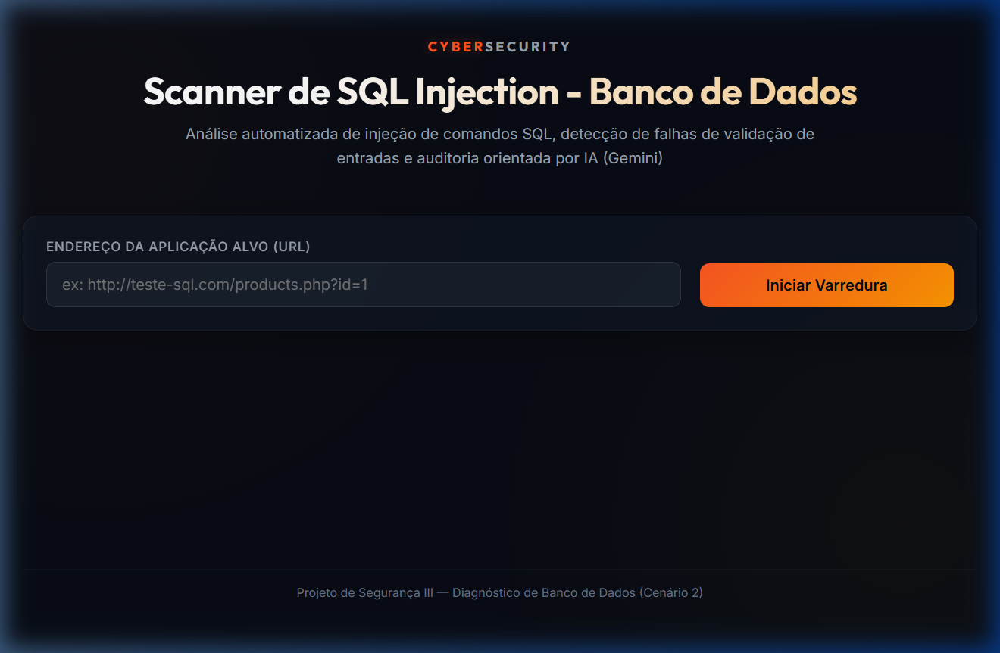
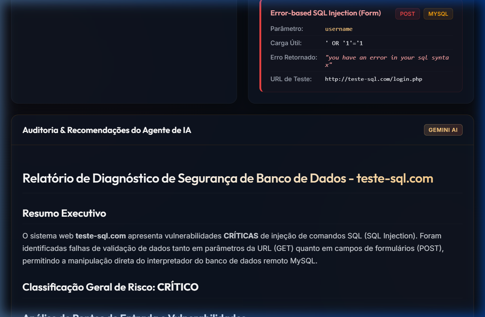
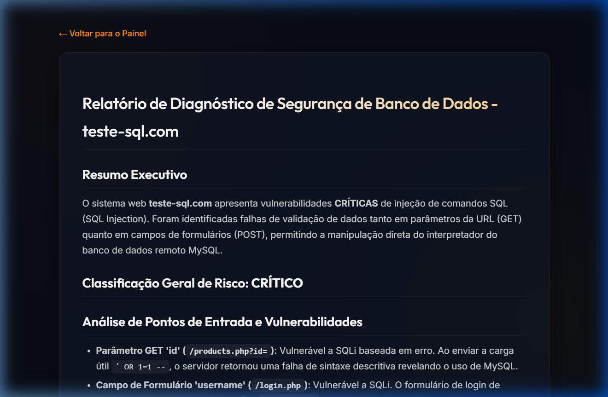

# Diagnóstico e Auditoria de SQL Injection em Aplicações Web

Uma aplicação web voltada para a detecção de vulnerabilidades de **SQL Injection (SQLi)** e auditoria orientada por inteligência artificial com o **Google Gemini** (Vertex AI). A ferramenta analisa parâmetros de consulta em requisições GET e inspeciona formulários HTML para simular submissões de payloads maliciosos via POST. A partir dos erros de banco de dados identificados (MySQL, PostgreSQL, Oracle, SQLite, MSSQL), a IA gera um relatório de segurança detalhado e instruções de correção.

---

## Demonstração Visual

### 1. Painel Inicial (Dashboard)
A tela de entrada onde você define a URL alvo para realizar a varredura contra SQL Injection:


### 2. Resultados da Varredura
O painel exibe o mapeamento dos formulários encontrados, detalhes das vulnerabilidades de injeção identificadas (tipo, parâmetro, payload e erro do banco de dados) e o relatório de auditoria gerado pelo Gemini:


### 3. Visualização do Relatório (Nova Aba)
Interface limpa que exibe o relatório gerado pela IA estruturado em Markdown de forma isolada:


---

## Passo a Passo para Configuração e Execução

### Passo 1: Instalar Dependências do Sistema
Com o Python 3.10 ou superior instalado, execute o comando abaixo para instalar as bibliotecas necessárias:

```bash
pip install -r requirements.txt
```

### Passo 2: Configurar o Google Cloud SDK (GCP)
A ferramenta consome a API do Vertex AI. Certifique-se de que seu ambiente GCP está configurado:

1. **Instale o Google Cloud SDK** no seu sistema.
2. **Autentique-se** no terminal com:
   ```bash
   gcloud auth application-default login
   ```
3. Verifique se o seu projeto GCP ativo tem acesso habilitado à API do Vertex AI.

### Passo 3: Configurar Variáveis de Ambiente (`.env`)
Configure o arquivo `.env` na raiz da pasta `cenario-2/` com as suas credenciais e modelo do Gemini:

```env
GCP_PROJECT=seu-projeto-gcp
GCP_LOCATION=us-central1
GEMINI_MODEL=gemini-2.5-flash
```

### Passo 4: Iniciar o Servidor Flask e o Laboratório de Testes

Para realizar varreduras reais e seguras localmente, disponibilizamos um servidor deliberadamente vulnerável na pasta `server/`.

1. **Inicie o Servidor Vulnerável de Testes (Porta 5002):**
   Abra um novo terminal e execute:
   ```bash
   python server/vulnerable_server.py
   ```
   *Este servidor cria uma base SQLite em disco e simula rotas vulneráveis a SQL Injection via GET e POST.*

2. **Inicie o Servidor do Scanner (Porta 5001):**
   No terminal principal, execute:
   ```bash
   python app.py
   ```

3. **Acesse o Painel no navegador:**
   Abra [http://127.0.0.1:5001](http://127.0.0.1:5001).

4. **Execute o Teste Real:**
   * Insira a URL do seu laboratório local: `http://127.0.0.1:5002/` (ou diretamente `http://127.0.0.1:5002/products.php?id=1`).
   * Clique em **Iniciar Varredura**.
   * O scanner detectará os formulários e vulnerabilidades reais, enviando os diagnósticos ao Gemini para gerar a auditoria com IA.

5. **Executar Varredura Rápida (Mock/Bypass):**
   Caso queira testar apenas a renderização da interface e layout sem consumir requisições reais ou créditos da API da IA, insira o domínio fictício `http://teste-sql.com` e execute o scan.

### Passo 5: Analisar Resultados e Relatórios
1. **Dados na Tela**: O dashboard atualizará dinamicamente mostrando a listagem de formulários HTML mapeados e os parâmetros identificados como vulneráveis na base SQLite.
2. **Nova Aba**: Clique em **Abrir Relatório (Nova Aba)** para abrir o documento gerado em uma janela separada.
3. **Persistência**: Relatórios gerados são salvos na pasta `reports/` no formato `relatorio_<hostname>_<data_hora>.md`.

---

## Estrutura do Código e Arquitetura

O código segue um padrão modular limpo para fins didáticos, separando a lógica de backend, frontend e conexões com APIs:

### 1. Servidor e Interface (Backend & Frontend)

- **`app.py`**: Gerencia as rotas web no Flask (porta `5001`). Oferece as rotas para carregar a interface SPA (`/`), exibir o relatório em aba separada (`/report/<filename>`) e o endpoint de varredura (`/api/scan`). Possui um bypass dedicado para simular o comportamento de teste com `teste-sql.com`.
- **`config.py`**: Carrega e expõe as variáveis de ambiente necessárias para a inicialização do Vertex AI.
- **`server/vulnerable_server.py`**: Servidor de testes local vulnerável rodando de forma independente na porta `5002`. Oferece endpoints simulando falhas reais de SQL Injection via parâmetros GET e formulários POST integrados a um banco SQLite.
- **`templates/index.html`**: Fornece o layout HTML5 semântico com os containers de dados e a integração do `marked.js` para renderizar Markdown diretamente na página.
- **`templates/report.html`**: Template otimizado que exibe o relatório gerado em Markdown com um estilo de leitura focado.
- **`static/style.css`**: Folha de estilos vanilla contendo a identidade visual com tema escuro e detalhes em neon Âmbar/Laranja, além de animações de transição e componentes responsivos.
- **`static/app.js`**: Controlador javascript que realiza requisições assíncronas ao servidor backend, anima a barra de progresso em quatro etapas e renderiza os formulários e vulnerabilidades na tela.

### 2. Lógica do Scanner de Vulnerabilidade

- **`scanner/sql_scanner.py`**: Executa o rastreamento local de SQL Injection:
  - `clean_hostname(target)`: Extrai o nome de domínio principal da URL.
  - `extract_forms(url, html_content)`: Utiliza expressões regulares para mapear tags `<form>` e `<input>/<textarea>` no HTML da página.
  - `check_db_errors(html_response)`: Compara o corpo de resposta com um dicionário de assinaturas conhecidas de erro de banco de dados (MySQL, PostgreSQL, Oracle, SQLite, MSSQL).
  - `scan_url_parameters(url)`: Envia requisições GET alternando os parâmetros com cargas úteis de injeção (ex: `'`, `"`, `' OR 1=1 --`).
  - `scan_forms_post(url, forms)`: Envia requisições POST para as ações dos formulários simulando injeções ativas.
  - `run_sqli_scan(target_url)`: Coordena a execução de toda a análise GET/POST.

### 3. Integração com Inteligência Artificial

- **`scanner/prompts.py`**: Contém o prompt estruturado de IA (`SQLI_AUDIT_PROMPT`) com diretrizes estritas sobre análise de injeção de SQL, severidade de riscos e estruturação de tabelas de mitigação.
- **`scanner/ai_agent.py`**: Conecta ao Vertex AI usando o SDK oficial do Google, inicializando a chamada ao modelo Gemini e transmitindo os dados de diagnóstico em formato estruturado.
